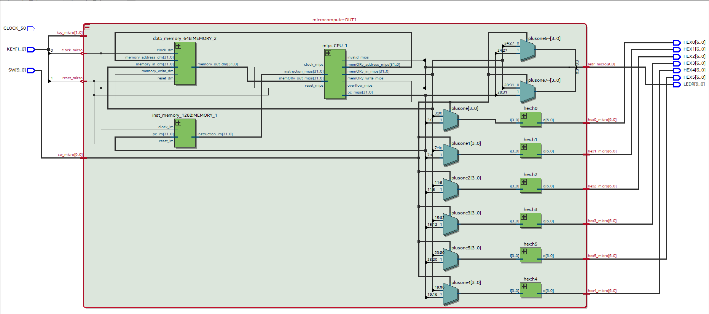

Project 1 Report
````````````````
----------------------
Part 1: Overall Design
----------------------
microcomputer.vhd implements three smaller components within itself. The first
component is the data_memory component, this component is responsible for
storing all the data in different registers. The second component is
inst_memory, this component is responsible for storing the program that CPU
is going to execute. The final component is the CPU which currently the CPU
only has a 32-bit ALU inside but more will be added as the course progresses.
The majority of the work for project 1 was done inside of the CPU we were
responsible for creating a 1-bit ALU that implements the following
operations: and, or, add, sub, slt. Once the 1-bit ALU was created the file
ALU_32.vhd was responsible for concatenating 32 1-bit ALUs to give us a
32-bit ALU. Below is a diagram that shows how all the components are
interconnected.   



   block diagram for microcomputer.vhd

--------------------
Part 2: Clock Signal
--------------------
The 50MHz clock is supplied to the test_mips.vhd file as an input.
There are three different clock options that have been provided for us.
The first option is to use key(0) as the clock signal meaning when you
press the button the clock progesses. The second option is to slow down
the 50MHz clock signal down to a 10MHz clock signal so the CPU would
run a little slower. The final option is to use the standard 50MHz clock
that is provided with the DE-10 lite board. For project 1 we are utilizing
the Key(0) as the clock so every time the button is pushed the program counter
is incremented by one address or 4 bytes. We are also able to reset the
program counter by pressing key(1) and that will reset the program counter
back to 0 so we are able to step through the program again by pressing key(0).
The VHDL code checks to make sure both key(0) is pressed and the rising
edge of the clock has occurred if both of those are true it increments the
program counter by 4 bytes.


--------------------------
Part 4: SLT Implementation
--------------------------

